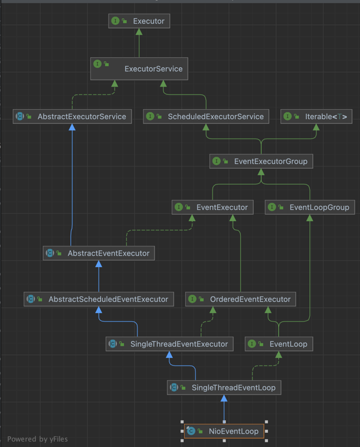

### OS 시스템콜해서 논블로킹 구현한 로직이 분명 있을텐데, 어디에 있을까?

NioEventLoop의 private int select(long deadlineNanos)에서 Java NIO의 Selector.select()를 호출한다.
> (Selector.select()는 시스템 콜 하는 부분으로 OS 커널을 통해 NIO를 구현한 부분이다.
> 이런 OS 커널을 통해 구현한 논블로킹은 이벤트를 이벤트 루프 기반의 폴링 메커니즘과 결합해서 비동기 처리를 구현했을 것이다.

++ 궁금증:  대부분 임베디드 서버는 Selector.select()를 사용해서 NIO를 구현했을까..?)

SingleThreadEventExecutor

